# scAgentKit

> 🤖 **Agent-Friendly Toolkit for Single-Cell RNA-seq Analysis**

[](https://www.r-project.org/)
[](LICENSE)
[](DESCRIPTION)

**scAgentKit** transforms single-cell RNA-seq analysis into composable, atomic functions designed for both human analysts and LLM agents. Every step accumulates reproducible scripts, decision logs, and figures in a single container.

```r
library(scAgentKit)

# Wrap your Seurat object
obj <- AgentSeurat(seurat_obj)

# Chain atomic operations
obj <- obj |>
  qc_add_metrics(species = "mouse") |>
  qc_mad(nmad = 3) |>
  sc_normalize() |>
  sc_find_hvg() |>
  sc_cluster(resolution = 0.3) |>
  annot_llm_annotate(chat_fn = chat_claude, tissue = "colon")

# Export reproducible script
export_script(obj, "analysis.R")  # Self-contained, runs from scratch
```

---

## ✨ Key Features

- **🔄 Unified Container**: Every function takes and returns an `AgentSeurat` object — no hidden state, no side effects
- **⚛️ Atomic Design**: Each function does one thing. Compose freely, re-run single steps without rebuilding downstream
- **📝 Auto-Reproducibility**: Every operation appends executable R code. Export a complete script at any time
- **🤖 LLM-Ready**: Built-in anti-hallucination annotation with strict JSON schemas and contradiction detection
- **📊 Full Traceability**: Decision logs, parameters, and figure paths tracked automatically
- **🔬 Production-Grade**: Handles Seurat v5 split layers, batch integration (Harmony), and publication workflows

---

## 🚀 Quick Start

### Installation

```r
# Install from local directory
devtools::install_local("path/to/scAgentKit")

# Required dependencies
install.packages(c("Seurat", "dplyr", "ggplot2", "Matrix", "qs"))

# Optional (for specific features)
install.packages(c("harmony", "clustree", "httr2"))
BiocManager::install(c("scDblFinder", "SingleCellExperiment"))
```

### Minimal Example

```r
library(scAgentKit)
library(Seurat)

# 1. Load data
seurat_obj <- readRDS("my_data.rds")
obj <- AgentSeurat(seurat_obj)

# 2. QC pipeline
obj <- obj |>
  qc_add_metrics(species = "mouse") |>
  qc_split(split_by = "sample") |>
  qc_mad(nmad = 3) |>
  qc_doublet(remove = TRUE) |>
  qc_merge()

# 3. Standard workflow
obj <- obj |>
  sc_normalize() |>
  sc_find_hvg(nfeatures = 2000) |>
  sc_scale() |>
  sc_pca(npcs = 50) |>
  sc_harmony(group_by_vars = "sample") |>
  sc_umap() |>
  sc_cluster(resolution = 0.3)

# 4. Find markers and annotate
obj <- obj |>
  sc_find_markers() |>
  sc_markers_summary(top_n = 30)

# 5. LLM annotation (requires API key)
chat_fn <- make_chat_fn_claude()  # or openai, deepseek, ollama
obj <- annot_llm_annotate(obj, chat_fn = chat_fn, tissue = "mouse colon")
obj <- annot_apply(obj, source = "llm", drop_rejected = TRUE)

# 6. Export everything
export_script(obj, "reproducible_analysis.R")
export_decisions(obj, "decisions.json")
report_html(obj, "report.html")
```

📖 **Full examples**: See [`inst/examples/`](inst/examples/) for complete pipelines including BRCA and colon datasets.

---

## 🔄 Typical Workflow

```mermaid
graph LR
    A[Raw Seurat] --> B[QC Metrics]
    B --> C[Filter & Doublet]
    C --> D[Normalize]
    D --> E[HVG + Scale]
    E --> F[PCA]
    F --> G[Harmony Integration]
    G --> H[UMAP + Clustering]
    H --> I[Find Markers]
    I --> J[LLM Annotation]
    J --> K[Export Script + Report]
    
    style A fill:#e1f5ff
    style K fill:#c8e6c9
    style J fill:#fff9c4
```



---

## 📦 The AgentSeurat Container

Every analysis step operates on a single S4 object that accumulates:

| Slot | Purpose |
|------|---------|
| `@data` | Seurat object (or list during per-sample QC) |
| `@stage` | Current pipeline stage (e.g., "clustered", "annotated") |
| `@decisions` | Structured log: function, params, timestamp, rationale |
| `@scripts` | R code snippets that reproduce the analysis |
| `@figures` | Registry of saved plots with descriptions |
| `@params` | Cross-step artifacts (markers, annotations, etc.) |

```r
obj
# <AgentSeurat>
#   Stage:      annotated
#   Cells:      42317
#   Decisions:  18 steps recorded
#   Figures:    8
#   Updated:    2026-04-28 14:23:11
```

**Why S4?** Strict contracts prevent silent bugs when agents compose calls. Clean interop with Bioconductor.

---

## 🛠️ Function Catalog

### Quality Control

| Function | Purpose |
|----------|---------|
| [`qc_add_metrics`](R/qc-add-metrics.R) | Add percent.mt / percent.ribo / percent.hb |
| [`qc_split`](R/qc-split.R) | Split by sample for per-sample filtering |
| [`qc_threshold`](R/qc-threshold.R) | Fixed floor/ceiling filters |
| [`qc_mad`](R/qc-mad.R) | MAD-based adaptive filtering |
| [`qc_doublet`](R/qc-doublet.R) | Doublet detection via scDblFinder |
| [`qc_remove_genes`](R/qc-remove-genes.R) | Drop mt/ribo/hb genes |
| [`qc_merge`](R/qc-merge.R) | Merge samples back into one object |

### Standard Pipeline

| Function | Purpose |
|----------|---------|
| [`sc_normalize`](R/sc-normalize.R) | LogNormalize (or CLR/RC) |
| [`sc_find_hvg`](R/sc-find-hvg.R) | Variable feature selection |
| [`sc_scale`](R/sc-scale.R) | Centering + optional regression |
| [`sc_pca`](R/sc-pca.R) | Principal component analysis |
| [`sc_harmony`](R/sc-harmony.R) | Batch integration (requires `group_by_vars`) |
| [`sc_umap`](R/sc-umap.R) | UMAP embedding |
| [`sc_cluster`](R/sc-cluster.R) | Commit to a clustering resolution |
| [`sc_find_markers`](R/sc-markers.R) | FindAllMarkers wrapper |
| [`sc_markers_summary`](R/sc-markers.R) | Filter, rank, export markers |

### Annotation

| Function | Purpose |
|----------|---------|
| [`annot_load_reference`](R/annot-match.R) | Load marker-to-celltype reference |
| [`annot_query_cellmarker`](R/annot-query-cellmarker.R) | Fetch CellMarker 2.0 (cached) |
| [`annot_match_reference`](R/annot-match.R) | Overlap-score clusters vs reference |
| [`annot_llm_annotate`](R/annot-llm.R) | LLM reconciliation with anti-hallucination |
| [`annot_apply`](R/annot-apply.R) | Write cell_type column, drop rejected clusters |

### IO & Reporting

| Function | Purpose |
|----------|---------|
| [`save_checkpoint`](R/io-checkpoint.R) | Persist full AgentSeurat to `.qs` |
| [`load_checkpoint`](R/io-checkpoint.R) | Resume from any stage |
| [`export_script`](R/io-export.R) | Emit self-contained `.R` file |
| [`export_decisions`](R/io-export.R) | Emit decision log as JSON |
| [`report_html`](R/io-report.R) | Single-file HTML report (decisions + figures + script) |

---

## 🤖 LLM Integration: Anti-Hallucination Design

The LLM annotation step is where most agents fail. **scAgentKit** uses four structural defenses:

1. **Strict JSON Schema**: Every cluster response must include `primary_annotation`, `confidence`, `supporting_markers`, `contradicting_markers`, `alternative_annotations`, `recommended_action`, and `reasoning`. No free prose.

2. **Required Contradiction Field**: Forcing the model to list evidence *against* its own choice dramatically reduces confabulation. If there are no contradictions, it returns an empty list — but it can't silently ignore inconsistent markers.

3. **Proportion Sanity Check**: The model receives the cluster's percentage of the dataset and assesses whether that fraction is plausible for the assigned cell type in the given tissue.

4. **Reject/Flag Actions**: The model can recommend `reject` (doublet/contaminant) or `flag_for_review`. `annot_apply(drop_rejected = TRUE)` honors this.

### Supported LLM Providers

The package is **provider-agnostic**. Supply any `chat_fn(system_prompt, user_prompt) -> character` that returns JSON.

**Built-in wrappers** (see [`inst/examples/llm_wrappers.R`](inst/examples/llm_wrappers.R)):
- 🟣 **Anthropic Claude** (via `ellmer`)
- 🟢 **OpenAI GPT-4** (via `ellmer`)
- 🔵 **DeepSeek / Qwen / Kimi** (OpenAI-compatible endpoints)
- 🟠 **Local Ollama** (no API key, no data transfer)

```r
# Example: Claude
chat_fn <- make_chat_fn_claude(model = "claude-sonnet-4-5")

# Example: DeepSeek
chat_fn <- make_chat_fn_deepseek(
  api_key = Sys.getenv("DEEPSEEK_API_KEY")
)

# Example: Local Ollama
chat_fn <- make_chat_fn_ollama(
  model = "llama3.1:70b",
  base_url = "http://localhost:11434"
)

obj <- annot_llm_annotate(
  obj,
  chat_fn = chat_fn,
  tissue = "mouse colon",
  expected_celltypes = c("T cell", "B cell", "Macrophage", "Enterocyte")
)
```

---

## 📚 Examples & Documentation

| Example | Description |
|---------|-------------|
| [`qc_pipeline_example.R`](inst/examples/qc_pipeline_example.R) | QC-only workflow |
| [`full_pipeline_example.R`](inst/examples/full_pipeline_example.R) | Load → QC → clustering → annotation |
| [`annotation_example.R`](inst/examples/annotation_example.R) | Resume from markers, iterate on LLM annotation |
| [`brca_pipeline.R`](inst/examples/brca_pipeline.R) | Real-world BRCA dataset with LLM batch selection |
| [`llm_wrappers.R`](inst/examples/llm_wrappers.R) | Concrete `chat_fn` implementations |

**Reference template**: [`inst/extdata/reference_template.tsv`](inst/extdata/reference_template.tsv)

---

## 🎯 Design Principles

1. **One container, one contract**: `f(AgentSeurat, ...) -> AgentSeurat`. No hidden globals, no external scratch files.

2. **Atomic, not pipeline**: Each function does one thing. Re-run a single step without rebuilding downstream.

3. **Reproducibility is a side-effect**: Every call appends raw R code to `@scripts`. Export at any time.

4. **Agent-friendly state**: Params, cell counts, and rationales stored in structured `@decisions`. Figures written to disk and registered, so vision-capable LLMs can inspect plots before deciding next steps.

5. **Defensive defaults with opinionated exceptions**: Most functions ship sensible defaults. High-stakes choices (batch variable, resolution, annotations) are *deliberately required* so they can never be applied silently.

---

## 🔧 Advanced Features

### Checkpoint & Resume

```r
# Save at any stage
obj <- save_checkpoint(obj, "checkpoints/after_clustering.qs")

# Resume later
obj <- load_checkpoint("checkpoints/after_clustering.qs")
obj <- annot_llm_annotate(obj, ...)  # Continue from here
```

### Vision-Enabled Resolution Selection

```r
# LLM reads the clustree plot and recommends resolution
obj <- sc_cluster_sweep(obj, resolutions = seq(0.05, 0.5, 0.05))
obj <- sc_resolution_recommend(
  obj,
  chat_fn = chat_claude,
  tissue = "mouse colon",
  expected_n_celltypes = c(10, 18),
  vision = TRUE  # Attach clustree.png to the LLM call
)

rec <- obj@params$resolution_recommendation
obj <- sc_cluster(obj, resolution = rec$chosen)
```

### Subcluster Refinement

```r
# Zoom into a specific cluster
obj <- annot_subcluster(
  obj,
  parent_cluster = "3",
  resolution = 0.2,
  chat_fn = chat_fn,
  tissue = "mouse colon"
)
```

### HTML Report

```r
report_html(obj, "analysis_report.html", title = "Ca vs Ctrl Analysis")
# Single self-contained HTML: decisions + figures (base64) + script
```

---

## 🛣️ Roadmap

**Current Status**: v0.1.22 — Production-ready for local single-user workflows.

**Completed**:
- ✅ Full QC, normalization, integration, clustering pipeline
- ✅ LLM annotation with anti-hallucination
- ✅ Seurat v5 compatibility (auto-handles split layers)
- ✅ HTML report generation
- ✅ CellMarker 2.0 integration
- ✅ Vision-enabled resolution recommendation

**Planned**:
- 🔲 Additional reference databases (CellTypist, PanglaoDB)
- 🔲 Differential expression wrappers
- 🔲 Trajectory analysis integration
- 🔲 Test suite expansion

**Out of Scope**: Multi-user SaaS, authentication, job queuing. This is a local-deployment toolkit.

---

## 🤝 Contributing

Contributions welcome! Please:
1. Open an issue to discuss major changes
2. Follow existing code style (roxygen2 docs, S4 methods)
3. Add examples to `inst/examples/` for new features
4. Update NAMESPACE via `devtools::document()`

---

## 📄 License

MIT License. See [LICENSE](LICENSE) file.

---

## 📖 Citation

If you use scAgentKit in your research, please cite:

```bibtex
@software{scAgentKit2026,
  author = {Kan Author},
  title = {scAgentKit: Agent-Friendly Toolkit for Single-Cell RNA-seq Analysis},
  year = {2026},
  version = {0.1.22},
  url = {https://github.com/yourusername/scAgentKit}
}
```

---

## 🙋 FAQ

**Q: Why S4 instead of R6 or lists?**  
A: Strict slot contracts prevent silent bugs when agents compose calls. Clean interop with Bioconductor (Seurat, SingleCellExperiment).

**Q: Can I use this without an LLM?**  
A: Absolutely. All QC and pipeline functions work standalone. LLM annotation is optional.

**Q: Does it work with Seurat v5?**  
A: Yes. Auto-handles split layers transparently.

**Q: Which LLM is best for annotation?**  
A: Claude Sonnet 4 and GPT-4o perform best. DeepSeek and Qwen are cost-effective alternatives. Local Ollama (llama3.1:70b) works for sensitive data.

**Q: How do I handle large datasets (>100k cells)?**  
A: Use `future` for parallelization. Set `options(future.globals.maxSize = 100 * 1024^3)`. Consider per-sample processing during QC.

**Q: Can I customize the LLM prompts?**  
A: Yes. The prompts are in [`R/annot-llm.R`](R/annot-llm.R). Fork and modify as needed.

---

<p align="center">
  Made with ❤️ for reproducible single-cell analysis
</p>
